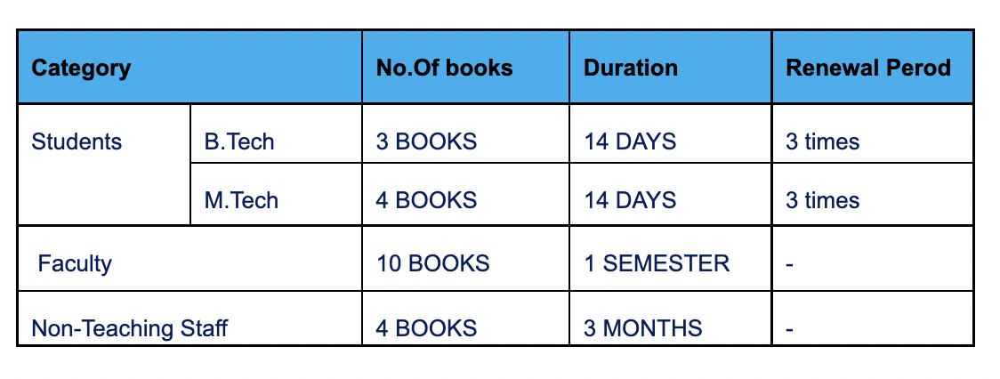

###       YCET Central Library Policies

##### General Policies

- Registration should be done to become a library member prior to using the library resources.
- ID card is compulsory for getting access to the library.
- Students and staff compulsory scan their barcoded ID number at E.Gate register whenever they    enter or exit the library.
- Text books, Printed materials, and issued books are not allowed to be taken inside the library.
- Books are arranged on shelves according to their Dewey Decimal Class Numbers. So you need not shelve them by yourself. After reading, books may be put at the table.
- Silence to be maintained in the library.
- The books and other materials which are being taken out of the library must be shown to the  library staff at the Circulation counter.
- Library borrower cards are not transferable, the borrower is responsible for the books borrowed on his/her card .
- Reference books, Journal/Magazines, Newspapers, Conference proceedings.. etc. are not allowed for borrowing.
- Use of PCs inside library is restricted to academic purpose only.

##### Circulation policies
- Library circulation controlled by Automation software KOHA.
- Each student shall be provided Borrower’s cards for taking books from the library.
- Producing student’s ID card is must for issuing Borrower’s Cards & Books.
 
##### Library privilliages of members 

##### Overdue charges
Issue of books will be initially for a period of 14 days and book should be returned on or before the due date stamped on  the date slip pasted on the book. The fine will be charged @  1.00 per day. If the due fall on a holiday the next working day shall be the due date. The students can renew the books thrice on or before the due date, if they wish. However return of books on the date of issue itself is not possible.

##### Book Lost
If the books are lost,  the borrower shall replace the books of the same edition or latest edition or pay double cost of the book after getting permission from the principal.

##### Care of Library Borrower Cards
Special care must be taken to maintain the library borrower cards. Do not fold, alter entries made on the cards, members are responsible for the entire set of library borrower card issued to them.

##### Loss of Cards
Loss of borrower card should be reported to the librarian in writing. After checking the membership details they will be issued a duplicate card on payment of Rs.25 -per card for the first time and Rs.50/- will be charged for further issuing of duplicate card.

##### Validity Of Cards
Library borrower cards are valid for the respective academic period. At the end of the academic period borrower cards shall be returned to the library.

##### No Dues Certificate
Each student shall obtain No dues certificate from the library after returning all the books issued , surrendering the borrowers cards and after paying outstanding dues ,if any.
 
##### Care of Library Books
Students are required to handle the books/journal very carefully, marking with pencil, writing or highlighting , tearing the pages or mutilating the same in any other way will be viewed  very seriously.
 
 
